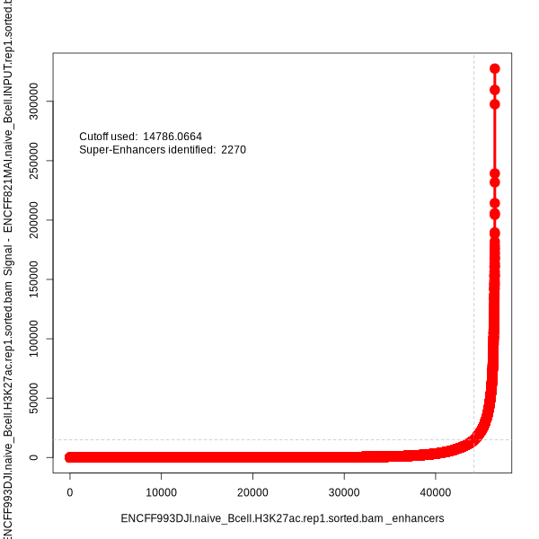
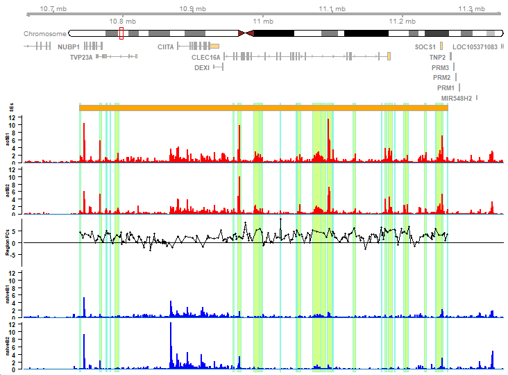

```{r, include=FALSE}
library(BiocStyle)
knitr::opts_chunk$set(echo = TRUE, fig.align = "center", message = FALSE, warning = FALSE)
```

# Introduction

**ECLIPSE** (**E**nhancer **C**alling and **L**inking with **I**ntegrated **P**rofiling and **S**tructure **E**valuation) provides a performant 
implementation of the [rank ordering of super enhancers (ROSE)](http://younglab.wi.mit.edu/super_enhancer_code.html) method for identifying super enhancers.
It provides options to increase the robustness of ROSE via signal transformations prior to thresholding and additional thresholding approaches.
It also increases flexibility by exposing parameters hidden in the original implementation.
ECLIPSE additionally contains novel functionality to identify sub-structural changes within enhancer regions between groups via sliding window and binning approaches.
It also contains visualization functions to generate high-quality plots of specific loci alongside arbitrary user-provided data.

## Installation

**ECLIPSE** is currently available on Github and can be installed as follows:

```{r, eval = FALSE}
if (!requireNamespace("devtools", quietly = TRUE))
    install.packages("devtools")

devtools::install_github("j-andrews7/ECLIPSE")
```

## Usage

Given paths to a BAM file and a BED file of peaks, ROSE can be run with the `run_rose` function.
Optionally, a control BAM file for input or IgG from the same sample can be provided.

Alternatively, `bamFile` objects for the treatment and control signal and a `GRanges` object for the peaks can be provided.

The output is a `GRanges` object containing all putative enhancers with their super enhancer designation in the `super` metadata column.

Below is an example of running ROSE on a BAM file of H3K27ac MINT ChIP-seq, an [input control](https://www.encodeproject.org/experiments/ENCSR056PPJ/) BAM file, and a BED file of peaks from [this ENCODE experiment of human naive B cells](https://www.encodeproject.org/experiments/ENCSR660EVU/).

```{r, eval = FALSE}
library(ECLIPSE)
# We'll use the BiocFileCache package to download and cache the files, which will take a few minutes the first time they're used.
library(BiocFileCache)

# For annotation
library(TxDb.Hsapiens.UCSC.hg38.refGene)
library(org.Hs.eg.db)
library(excluderanges)
suppressMessages(library(AnnotationHub))
ah <- AnnotationHub()
query_data <- subset(ah, preparerclass == "excluderanges")

hg38_blacklist <- query_data[["AH107305"]]
hg38_blacklist <- hg38_blacklist %>% 
  sort() %>% keepStandardChromosomes(pruning.mode = "coarse")

txdb <- TxDb.Hsapiens.UCSC.hg38.refGene

# Limit to canonical chromosomes, out of bound warnings will abound if not done
txdb <- keepStandardChromosomes(txdb, pruning.mode = "coarse")
org.db <- org.Hs.eg.db

bfc <- BiocFileCache(ask = FALSE)
naiveB1_treat_url <- "https://www.encodeproject.org/files/ENCFF993DJI/@@download/ENCFF993DJI.bam"
naiveB1_treat_path <- bfcrpath(bfc, naiveB1_treat_url)

naiveB1_treat_bw_url <- "https://www.encodeproject.org/files/ENCFF901BFR/@@download/ENCFF901BFR.bigWig"
naiveB1_treat_bw_path <- bfcrpath(bfc, naiveB1_treat_bw_url)

naiveB1_control_url <- "https://www.encodeproject.org/files/ENCFF821MAI/@@download/ENCFF821MAI.bam"
naiveB1_control_path <- bfcrpath(bfc, naiveB1_control_url)

naiveB1_peaks_url <- "https://www.encodeproject.org/files/ENCFF590DFY/@@download/ENCFF590DFY.bed.gz"
naiveB1_peaks_path <- bfcrpath(bfc, naiveB1_peaks_url)

naiveB1_treat_bam <- BamFile(naiveB1_treat_path)
naiveB1_control_bam <- BamFile(naiveB1_control_path)
naiveB1_peaks <- readBed(naiveB1_peaks_path)

naiveB1_enhancers <- run_rose(treatment = naiveB1_treat_bam,
                              control = naiveB1_control_bam,
                              peaks = naiveB1_peaks,
                              txdb = txdb,
                              org.db = org.db,
                              stitch.distance = 12500,
                              tss.exclusion.distance = 2500,
                              max.unique.gene.tss.overlap = 2,
                              drop.no.signal = TRUE)

naiveB1_enhancers_width_normalized <- run_rose(treatment = naiveB1_treat_bam,
                                               control = naiveB1_control_bam,
                                               peaks = naiveB1_peaks,
                                               txdb = txdb,
                                               org.db = org.db,
                                               stitch.distance = 12500,
                                               tss.exclusion.distance = 2500,
                                               max.unique.gene.tss.overlap = 2,
                                               drop.no.signal = TRUE,
                                               normalize.by.width = TRUE)
```

### Other Input Types

Though the example above uses BAM files, `run_rose` can also accept BigWig or bedGraph signal files, though doing so alters the coverage calculation. See `?run_rose` for more information.

### Visualization

Can't be a super enhancer package without the classic swoosh plot.

```{r, eval = FALSE}
plot_enhancer_curve(naiveB1_enhancers, factor_label = "H3K27ac")
```


## Comparison to Original ROSE Implementation

With default parameters, `run_rose` is an attempt to closely match the results from the original ROSE implementation.

For comparison's sake, here is the enhancer ranking curve from the original ROSE implementation for [H3K27ac Mint-ChIP-seq from
naive B cells](https://www.encodeproject.org/experiments/ENCSR660EVU/) as provided by ENCODE:

```{r, fig.cap="Enhancer rank plot output by original ROSE implementation.", fig.align = "center", echo=FALSE}

```

These results are using no TSS exclusion to compare the underlying classification approach as closely as possible.

Notably, the number of super-enhancers identified are not a perfect match due to very slight differences in the coverage calculations.
However, all super-enhancers identified in the original implementation are also called by ECLIPSE.
Determination of the root cause of the minor discrepancy is ongoing.

### Known Methodological Differences between ECLIPSE and ROSE

 - ROSE performs read extension after pulling all reads that overlap a region, whereas ECLIPSE extends all reads and then pulls those that overlap. This is much faster, but likely results in very minor coverage calculation differences.
 
## Important Observations of ROSE

We have closely examined and tested the ROSE source code and have made the following observations:

 1. ROSE does not use region size scaling for final signal ranking in a meaningful way. The signals in ROSE are derived as follows:
   - All reads overlapping a given region are pulled.
   - These reads are extended by 200 bp.
   - The coverage for each base in the region is counted (via samtools view, which is very slow when done on each individual region). 
     - There are alternative implementations floating around Github that use a tool called bamliquidator that is much faster, but it's also difficult to install and poorly supported.
   - The coverage for the region is summed and divided by the region width to generate a density factor.
   - The density factor is then divided by the MMR factor (mapped reads/1000000) to generate a library size-normalized signal factor.
   - This factor is saved for each stitched region into the "mapped GFF" files.
   - The "signal" is then calculated from the "mapped GFF" files for the stitched regions by multiplying the library size-normalized factor by the width of the region. Ultimately, this just results in the library size-normalized sum of coverage for a region, independent of its size (ADD EXAMPLE TO DEMONSTRATE THIS.)
     - This biases ROSE towards large regions, potentially ignoring smaller regions that have a higher signal density that may still have an outsized regulatory impact. This is worth exploring further.
   - ECLIPSE provides an option (`normalize.by.width`) to scale the final signal by the total constituent peak width for each region.
 2. ROSE has a bug in the unstitching process whereby it rarely does not unstitch regions that clearly span TSSes from 3 or more unique genes.
   - What exactly the bug is remains unclear, but it may be related to how ROSE is performing overlaps.
   - ECLIPSE does not have this issue, which alters the final number of regions returned (and thus SEs called) to a minor degree.
 3. Outliers have an outsized impact on the signal ranking and final classifications in ROSE.
   - To elaborate, if you remove the top 5 or 10 regions by signal, the ranking of the remaining regions changes dramatically and the threshold for super-enhancer classification is much different. This results in fickle classifications whereby you can easily get 100s more/less SEs from sample to sample of the exact same tissue or cell type just depending on how dramatic the outliers are.
   - We *highly* recommend using the transformation capabilities included in ECLIPSE to monotonically transform the signal prior to ranking, which will dramatically reduce the impact of outliers on the final classification while maintaining the same rank. See the `transformation`, `thresh.method`, `first.threshold`, and `arbitrary.threshold` parameters in `?run_rose` for options and additional information.
   
This list is incomplete and will be updated as we continue to explore the differences between ECLIPSE and ROSE.

## Running with TSS Exclusion

ROSE is frequently ran with TSS exclusion to remove peaks fully contained within a window (usually +/- 2.5kb) around each TSS.

What is less well documented in the original ROSE implementation is that this also invokes an unstitching process of regions that overlap TSSes (+/- 50 bp) from 3 or more unique genes, whereby a stitched region is then split back into its original constituent elements. 

The original implementation provides no way to alter or disable this behavior, but ECLIPSE does.

```{r, eval = FALSE}
# With TSS exclusion and unstitching, a la the original ROSE implementation
res_tss_exl <- run_rose(treatment = treat_path,
                        control = control_path,
                        peaks = peaks_path,
                        txdb = txdb,
                        tss.exclusion.distance = 2500,
                        max.unique.gene.tss.overlap = 2)

# With TSS exclusion but no unstitching
res_tss_exl_no_unstitch <- run_rose(treatment = treat_path,
                                    control = control_path,
                                    peaks = peaks_path,
                                    txdb = txdb,
                                    tss.exclusion.distance = 2500,
                                    max.unique.gene.tss.overlap = NULL)
```

We can then see how these differ in the number of SEs identified.

With TSS exclusion and unstitching, as is commonly done with the original implementation for H3K27ac data:

```{r, eval = FALSE}
plot_enhancer_curve(res_tss_exl, factor_label = "H3K27ac")
```

With TSS exclusion but no unstitching:

```{r, eval = FALSE}
plot_enhancer_curve(res_tss_exl_no_unstitch, factor_label = "H3K27ac")
```

These settings have dramatic impacts on the final number of regions returned and the number (and size) of SEs identified.

```{r, eval = FALSE}
message("Number of regions returned with TSS exclusion and unstitching: ", length(res_tss_exl))
message("Number of regions returned with TSS exclusion and no unstitching: ", length(res_tss_exl_no_unstitch))

message("Number of SEs identified with TSS exclusion and unstitching: ", length(res_tss_exl[res_tss_exl$super]))
message("Number of SEs identified with TSS exclusion and no unstitching: ", length(res_tss_exl_no_unstitch[res_tss_exl_no_unstitch$super]))

message("Average width of SEs with TSS exclusion and unstitching: ", mean(width(res_tss_exl[res_tss_exl$super])))
message("Average width of SEs with TSS exclusion and no unstitching: ", mean(width(res_tss_exl_no_unstitch[res_tss_exl_no_unstitch$super])))
```

Given the lack of documentation or discussion on this behavior in the original implementation or papers, it is unclear how this should be handled in practice.

### Other Previously Hidden Parameters

**ECLIPSE** also allows things like read extension length to be adjusted, which ROSE sets at 200 with no convenient way to adjust.

Though this is a reasonable estimate for most ChIP-seq data, we can also determine the fragment length from the data as specified by [csaw](https://bioconductor.org/books/3.20/csawBook/counting-reads-into-windows.html#sec:ccf).

```{r, eval = FALSE}
# Removing duplicates for this is often necessary as there tends to be an artifactual peak at a distance equal to the read length.
dedup.param <- readParam(minq = 20, dedup = TRUE)
x <- correlateReads(treat_path, max.dist = 500, param = dedup.param)
plot(0:500, x, type = "l", ylab = "CCF", xlab = "Delay (bp)")
```

200 bp is a reasonable estimate, but we could also use the peak of the cross-correlation function as the 
fragment length to provide to the `read.ext` parameter in `run_rose`.

```{r, eval = FALSE}
frag.len <- maximizeCcf(x)
frag.len
```


## Using BigWig or bedGraph Inputs

At times, it may be more convenient to use BigWig or bedGraph files for signal input. 
These can be imported as GRanges objects and passed as inputs to `run_rose`.

ECLIPSE handles these slightly different than BAM files, for which it uses the total number of reads as an additional normalization step, as that's what ROSE does.
ECLIPSE presumes that the signal is already normalized for library size and does not perform this step.

In some cases, the input or IgG control signal has already been incorporated (subtracted out, used to calculate a BigWig of foldchanges, etc) as appropriate and thus will not be provided. 

This is one such case, as this BigWig file is the foldchange of H3K27ac signal in naive B cells over input.

As such, it makes sense to set `floor = 0` for the "signal" calculation as much of the artifact noise should have been removed.

```{r, eval = FALSE}
library(rtracklayer)

naiveB1_bw <- rtracklayer::import(treat_bw_path)

naiveB1_enhancers_bigwig <- run_rose(treatment = naiveB1_bw, peaks = peaks,
                              txdb = txdb, org.db = org.db, stitch.distance = 12500, tss.exclusion.distance = 2500,
                              max.unique.gene.tss.overlap = 2, floor = 0, normalize.by.width = TRUE)
```

## Exploring Transformations & Thresholding Methods

As mentioned above, ROSE is highly sensitive to outliers in the signal, which can dramatically alter the final classification of regions.
ECLIPSE provides a parameter for applying a transformation function to all regions prior to ranking to reduce the impact of outliers on the final classification.

However, it is unclear which transformation(s) are most appropriate for this task.
These transformations may also change the shape of the curve, which may necessitate a change in the thresholding method used.

### Transformations

As it stands, the original ROSE implementation uses an arbitrary thresholding approach.
It'd be nice to use a more statistically rigorous approach based on the distribution of the (potentially width-normalized) signal for each region.

It'd be convenient if we could get a relatively normal distribution of signal values for each region, which would allow us to use a Z-score or similar approach to thresholding.

As such, let's test a few transformations, make some histograms/qqplots, and see what looks best.
We will also do this for width-normalized signal to see how that looks.

```{r, eval = FALSE}
logistic_transform_scaled_robust <- function(x) {
  center <- median(x, na.rm = TRUE)
  spread <- IQR(x, na.rm = TRUE) # interquartile range
  if (spread == 0) spread <- 1   # fallback if IQR=0
  
  1 / (1 + exp(-(x - center) / spread))
}

probit_transform_scaled_robust <- function(x) {
  center <- median(x, na.rm = TRUE)
  spread <- IQR(x, na.rm = TRUE)
  if (spread == 0) spread <- 1
  
  pnorm((x - center) / spread)
}


# --------------------------------------------------
# 2) Winsorized Min–Max Scaling
# --------------------------------------------------
#   - Caps extreme values at chosen quantiles
#   - Then applies linear min–max scaling
#   - Maps data into [0, 1]

winsorized_minmax_scale <- function(x, upper_quantile = 0.999, lower_quantile = 0.01) {
  # 1) Identify cutoffs
  q_high <- quantile(x, probs = upper_quantile)
  q_low  <- quantile(x, probs = lower_quantile)
  
  # 2) Winsorize
  x_winsor <- pmax(pmin(x, q_high), q_low)
  
  # 3) Min–Max scaling
  x_min <- min(x_winsor)
  x_max <- max(x_winsor)
  
  (x_winsor - x_min) / (x_max - x_min)
}


# --------------------------------------------------
# 3) Rank-Inverse Normal Transform (RINT)
# --------------------------------------------------
#   - Rank the data -> convert rank to percentile -> map via inverse normal
#   - Often used to create data with near-Gaussian distribution

rint_transform <- function(x) {
  # 1) Get rank-based percentile
  r <- rank(x, ties.method = "average", na.last = "keep")
  n <- sum(!is.na(x))
  # Convert rank to a fraction in (0,1). 
  # Add a small offset to avoid exactly 0 or 1.
  p <- (r - 0.5) / n
  
  # 2) Map percentiles via inverse normal (qnorm)
  qnorm(p)
}


# --------------------------------------------------
# 4) Combination: Log + Min–Max
# --------------------------------------------------
#   - First apply a log-like transform (log or log1p) 
#   - Then map results into [0,1] with min–max scaling
#   - Uses pseudocount to avoid 0/negative values

log_minmax_transform <- function(x) {
  # 1) Log transform
  x_log <- log1p(x) # or simply log(x_shifted)
  
  # 2) Min–Max scale
  x_min <- min(x_log)
  x_max <- max(x_log)
  (x_log - x_min) / (x_max - x_min)
}


# --------------------------------------------------
# 5) Combination: asinh + Min–Max
# --------------------------------------------------
#   - arcsinh is a 'soft log' that can handle negative values
#   - Then do min–max scaling
#   - Very useful when data can be negative and large positive

asinh_minmax_transform <- function(x, scale_param = 1) {
  # 1) 'soft log' transform
  x_asinh <- asinh(scale_param * x)
  
  # 2) Min–Max scale
  x_min <- min(x_asinh)
  x_max <- max(x_asinh)
  
  (x_asinh - x_min) / (x_max - x_min)
}


# --------------------------------------------------
# Other basic transforms
# --------------------------------------------------

## Power transform: x^alpha
power_transform <- function(x, alpha = 0.2) {
  x^alpha
}

# Normalize to between [0, 1] and then cube to create more separation at high values 
scale_cube_transform <- function(x) { 
    x <- x
    mmax <- max(x)
    mmin <- min(x)
    x <- (x-mmin)/pmax(mmax-mmin, 1e-8)
    x <- x^3
    x
}

# Cumulative proportion of signal for each element
cumal_prop_transform <- function(x) {
    x <- x/sum(x)
    x <- cumsum(x)
    x <- 1 - x # Reverse so that the highest values are at the top
    x
}

# Cumulative proportion of signal for each element
cumal_prop_log2_transform <- function(x) {
    x <- log2(x)
    x <- x/sum(x)
    x <- cumsum(x)
    x <- 1 - x # Reverse so that the highest values are at the top
    x
}

## sqrt transform
sqrt_transform <- function(x) {
  sqrt(x)
}

## cuberoot transform
cuberoot_transform <- function(x) {
  x^(1/3)
}

## Box-Cox: (x^lambda - 1) / lambda, with log fallback
boxcox_transform <- function(x, lambda = 0.2) {
  if (lambda == 0) {
    log(x)
  } else {
    (x^lambda - 1) / lambda
  }
}

## Robust z-score transform: (x - median) / MAD
robust_z_transform <- function(x) {
  (x - median(x)) / mad(x)
}

## And with log2 transformation first
robust_log2_z_transform <- function(x) {
  (log2(x) - median(log2(x))) / mad(log2(x))
}

## log1p transform: log(1 + x)
log1p_transform <- function(x) {
  log1p(x)
}

## arcsinh transform
asinh_transform <- function(x) {
  asinh(x)
}

## arcsinh with scaling
asinh_transform_scaled <- function(x) {
    scale <- IQR(x, na.rm = TRUE) # interquartile range
    asinh(scale * x) / scale
}

## Classic min–max (no winsorizing)
minmax_scale <- function(x) {
  (x - min(x)) / (max(x) - min(x))
}

## Logistic transform (simple)
logistic_transform <- function(x) {
  1 / (1 + exp(-x))
}

# Winsorization
winsorize_transform <- function(x, upper_quantile = 0.999, lower_quantile = 0.01) {
    q_high <- quantile(x, probs = upper_quantile)
    q_low  <- quantile(x, probs = lower_quantile)
    
    pmax(pmin(x, q_high), q_low)
}

# Modified winsorization where rank of winsorized values are maintained by adding rank of winsorized values * a pseudocount
# Only applied to upper quantile.
winsorize_maintain_rank_transform <- function(x,
                                  upper_quantile = 0.999,
                                  pseudocount = 0.001) {
  # 1) Find the capping threshold
  cap_value <- quantile(x, probs = upper_quantile)
  message("Winsorizing at value: ", cap_value)
  
  # 2) Identify which x values exceed that threshold
  idx_above <- which(x > cap_value)
  
  if (length(idx_above) > 0) {

      # 3) Extract the subset of x that are above the threshold
      x_above <- x[idx_above]
      
      # 4) Determine the relative rank among these "above" values
      #    We'll assign a strictly increasing offset based on rank order.
      #    Order them from smallest to largest, then assign rank 1, 2, 3, ...
      order_above <- order(x_above)       # returns indices of x_above in ascending order
      ranks       <- seq_along(x_above)   # 1 to number of capped points

      new_values <- numeric(length(x_above))
      
      # 5) For each capped value, set it to cap_value + (pseudocount * rank)
      #    This ensures no ties among capped points and preserves their internal order.
      for (i in seq_along(order_above)) {
        # 'order_above[i]' is the index in 'x_above' of the i-th smallest capped value
        idx_in_x_above <- order_above[i]  # e.g. i-th smallest gets rank i
        new_values[idx_in_x_above] <- cap_value + (pseudocount * ranks[i])
      }
      
      # 6) Put these new values back into 'x' at the original positions of the capped points
      x_wins <- x
      x[idx_above] <- new_values
    }
  x
}

# log2(x + 1) + Winsorization
log2_winsorize_transform <- function(x, upper_quantile = 0.999, lower_quantile = 0.01) {
    x <- log2(x + 1)
    q_high <- quantile(x, probs = upper_quantile)
    q_low  <- quantile(x, probs = lower_quantile)
    
    pmax(pmin(x, q_high), q_low)
}

# Modified winsorization where rank of winsorized values are maintained by adding rank of winsorized values * a pseudocount
# Only applied to upper quantile.
log2_winsorize_maintain_rank_transform <- function(x,
                                  upper_quantile = 0.999,
                                  pseudocount = 0.001) {
    x <- log2(x + 1)
  # 1) Find the capping threshold
  cap_value <- quantile(x, probs = upper_quantile)
  message("Winsorizing at value: ", cap_value)
  
  # 2) Identify which x values exceed that threshold
  idx_above <- which(x > cap_value)
  
  if (length(idx_above) > 0) {

      # 3) Extract the subset of x that are above the threshold
      x_above <- x[idx_above]
      
      # 4) Determine the relative rank among these "above" values
      #    We'll assign a strictly increasing offset based on rank order.
      #    Order them from smallest to largest, then assign rank 1, 2, 3, ...
      order_above <- order(x_above)       # returns indices of x_above in ascending order
      ranks       <- seq_along(x_above)   # 1 to number of capped points

      new_values <- numeric(length(x_above))
      
      # 5) For each capped value, set it to cap_value + (pseudocount * rank)
      #    This ensures no ties among capped points and preserves their internal order.
      for (i in seq_along(order_above)) {
        # 'order_above[i]' is the index in 'x_above' of the i-th smallest capped value
        idx_in_x_above <- order_above[i]  # e.g. i-th smallest gets rank i
        new_values[idx_in_x_above] <- cap_value + (pseudocount * ranks[i])
      }
      
      # 6) Put these new values back into 'x' at the original positions of the capped points
      x_wins <- x
      x[idx_above] <- new_values
    }
  x
}

# Try winsorized min-max scale with rank maintenance
winsorize_maintain_rank_minmax_transform <- function(x, upper_quantile = 0.999, pseudocount = 0.001) {
  # Winsorize with rank maintenance
  cap_value <- quantile(x, probs = upper_quantile)
  idx_above <- which(x > cap_value)
  
  if (length(idx_above) > 0) {
    x_above <- x[idx_above]
    order_above <- order(x_above)
    ranks <- seq_along(x_above)
    new_values <- numeric(length(x_above))
    
    for (i in seq_along(order_above)) {
      idx_in_x_above <- order_above[i]
      new_values[idx_in_x_above] <- cap_value + (pseudocount * ranks[i])
    }
    
    x[idx_above] <- new_values
  }
  
  # Min–Max scaling
  x_min <- min(x)
  x_max <- max(x)
  
  (x - x_min) / (x_max - x_min)
}

```

Now for each transformation function, we'll apply it to the signal to the signal column and plot the histograms, qqplots, and rank plot.

```{r, eval = FALSE}
library(patchwork)

# Named list of transformations, underscore delimiter
transformations <- list(
  no_transform = function(x) x,
  logistic_transform_scaled_robust = logistic_transform_scaled_robust,
  probit_transform_scaled_robust = probit_transform_scaled_robust,
  winsorized_minmax_scale = winsorized_minmax_scale,
  rint_transform = rint_transform,
  log_minmax_transform = log_minmax_transform,
  asinh_minmax_transform = asinh_minmax_transform,
  power_transform = power_transform,
  scale_cube_transform = scale_cube_transform,
  cumal_prop_transform = cumal_prop_transform,
  cumal_prop_log2_transform = cumal_prop_log2_transform,
  sqrt_transform = sqrt_transform,
  cuberoot_transform = cuberoot_transform,
  boxcox_transform = boxcox_transform,
  robust_z_transform = robust_z_transform,
  #robust_log2_z_transform = robust_log2_z_transform,
  log1p_transform = log1p_transform,
  asinh_transform = asinh_transform,
  asinh_transform_scaled = asinh_transform_scaled,
  minmax_scale = minmax_scale,
  logistic_transform = logistic_transform,
  winsorize_transform = winsorize_transform,
  winsorize_maintain_rank_transform = winsorize_maintain_rank_transform,
  log2_winsorize_transform = log2_winsorize_transform,
  log2_winsorize_maintain_rank_transform = log2_winsorize_maintain_rank_transform,
  winsorize_maintain_rank_minmax_transform = winsorize_maintain_rank_minmax_transform
)

transformed_SEs <- lapply(transformations, function(f) {
    ses <- naiveB1_enhancers
    ses$rankby_signal <- f(ses$rank_signal)
    ses
})

names(transformed_SEs) <- names(transformations)

# Plot histograms and qqplots in PDF with new page for each transformation, both plots on one page
pdf("transformed_signal_distributions.NaiveB1.pdf", width = 25, height = 6)
for (i in seq_along(transformed_SEs)) {
    message(names(transformations)[[i]])
    ses <- transformed_SEs[[i]]
    sigs <- ses$rankby_signal
    df <- data.frame(signal = sigs)
    p <- ggplot(df, mapping = aes(signal)) + geom_histogram(bins = 75) + labs(title = (names(transformations)[[i]]), x = "Transformed Signal")  + theme_bw() + theme(aspect.ratio = 1)
    p2 <- plot_qq(ses, "rankby_signal", "normal") + labs(subtitle = (names(transformations)[[i]]), do.raster = TRUE) + theme(aspect.ratio = 1)
    p3 <- NULL
    if (min(sigs) > 0) {
        p3 <- plot_qq(ses, "rankby_signal", "lognormal") + labs(subtitle = (names(transformations)[[i]]), do.raster = TRUE) + theme(aspect.ratio = 1)
    }
    p4 <- plot_qq(ses, "rankby_signal", "negative binomial") + labs(subtitle = (names(transformations)[[i]]), do.raster = TRUE) + theme(aspect.ratio = 1)
    p5 <- plot_enhancer_curve(ses, factor.label = "H3K27ac", do.raster = TRUE, show.legend = FALSE) + theme(aspect.ratio = 1)
    
    print(p + p2 + p3 + p4 + p5)
}
dev.off()

transformed_SEs_width_norm <- lapply(transformations, function(f) {
    ses <- naiveB1_enhancers_width_normalized
    ses$rankby_signal <- f(ses$rank_signal)
    ses
})

# Plot histograms and qqplots in PDF with new page for each transformation, both plots on one page
pdf("transformed_signal_distributions.NaiveB1.width_norm.pdf", width = 25, height = 6)
for (i in seq_along(transformed_SEs_width_norm)) {
    message(names(transformations)[[i]])
    ses <- transformed_SEs_width_norm[[i]]
    sigs <- ses$rankby_signal
    df <- data.frame(signal = sigs)
    p <- ggplot(df, mapping = aes(signal)) + geom_histogram(bins = 75) + labs(title = (names(transformations)[[i]]), x = "Transformed Signal") + theme_bw() + theme(aspect.ratio = 1)
    p2 <- plot_qq(ses, "rankby_signal", "normal") + labs(subtitle = (names(transformations)[[i]]), do.raster = TRUE) + theme(aspect.ratio = 1)
    p3 <- NULL
    if (min(sigs) > 0) {
        p3 <- plot_qq(ses, "rankby_signal", "lognormal") + labs(subtitle = (names(transformations)[[i]]), do.raster = TRUE) + theme(aspect.ratio = 1)
    }
    p4 <- plot_qq(ses, "rankby_signal", "negative binomial") + labs(subtitle = (names(transformations)[[i]]), do.raster = TRUE) + theme(aspect.ratio = 1)
    p5 <- plot_enhancer_curve(ses, factor.label = "H3K27ac", do.raster = TRUE, show.legend = FALSE) + theme(aspect.ratio = 1)
    
    print(p + p2 + p3 + p4 + p5)
}
dev.off()
```

## Re-running with Different Parameters

If already run, one can re-run `run_rose` without performing stitching, re-calculating coverage, and annotating, which is much faster.
Simply set `force = FALSE` in the `run_rose` call and those steps will be skipped.
This allows one to test different transformations or thresholding methods very quickly.

```{r, eval = FALSE}
# Let's try log2(x + 1) as a transformation.
naiveB1_enhancers_from_existing <- run_rose(peaks = naiveB1_enhancers,
                                            transformation = function(x) log2(x + 1), 
                                            force = FALSE)

plot_enhancer_curve(naiveB1_enhancers_from_existing, factor.label = "H3K27ac", show.legend = FALSE)
```

Runs almost instantly, huzzah.

## Differential Sub-Structural Analysis

**ECLIPSE** provides a way to compare signal in SEs between groups at a high resolution via small bins to identify sub-structural SE changes.

Often, when super enhancers are compared, binary overlaps or intersects are used to define "specific" super enhancers for a given lineage or condition.

But this ignore alterations within SEs that overlap between groups.
For more involved studies, one might go back to the constituent peaks to compare high signal regions within SEs, but this process is still subject to many of the same issues as peak calling in general.

This is where differential sub-structural analysis comes in.
We try to maintain simplicity while increasing robustness and flexibility.

For this example, we'll compare naive B cells and activated B cells from ENCODE, two replicates for each.
These groups have enough similarities to demonstrate how this analysis looks for similar regions, but also enough changes in SE structure to be interesting.

### Download Data

```{r, eval = FALSE}
naiveB1_treat_url <- "https://www.encodeproject.org/files/ENCFF993DJI/@@download/ENCFF993DJI.bam"
naiveB1_treat_path <- bfcrpath(bfc, naiveB1_treat_url)

naiveB1_treat_bw_url <- "https://www.encodeproject.org/files/ENCFF901BFR/@@download/ENCFF901BFR.bigWig"
naiveB1_treat_bw_path <- bfcrpath(bfc, naiveB1_treat_bw_url)

naiveB1_control_url <- "https://www.encodeproject.org/files/ENCFF821MAI/@@download/ENCFF821MAI.bam"
naiveB1_control_path <- bfcrpath(bfc, naiveB1_control_url)

naiveB1_peaks_url <- "https://www.encodeproject.org/files/ENCFF590DFY/@@download/ENCFF590DFY.bed.gz"
naiveB1_peaks_path <- bfcrpath(bfc, naiveB1_peaks_url)

naiveB1_treat_bam <- BamFile(naiveB1_treat_path)
naiveB1_control_bam <- BamFile(naiveB1_control_path)
naiveB1_peaks <- readBed(naiveB1_peaks_path)
# ---
naiveB2_treat_url <- "https://www.encodeproject.org/files/ENCFF808SRS/@@download/ENCFF808SRS.bam"
naiveB2_treat_path <- bfcrpath(bfc, naiveB2_treat_url)

naiveB2_treat_bw_url <- "https://www.encodeproject.org/files/ENCFF926THG/@@download/ENCFF926THG.bigWig"
naiveB2_treat_bw_path <- bfcrpath(bfc, naiveB2_treat_bw_url)

naiveB2_control_url <- "https://www.encodeproject.org/files/ENCFF847PCC/@@download/ENCFF847PCC.bam"
naiveB2_control_path <- bfcrpath(bfc, naiveB2_control_url)

naiveB2_peaks_url <- "https://www.encodeproject.org/files/ENCFF957BIX/@@download/ENCFF957BIX.bed.gz"
naiveB2_peaks_path <- bfcrpath(bfc, naiveB2_peaks_url)

naiveB2_treat_bam <- BamFile(naiveB2_treat_path)
naiveB2_control_bam <- BamFile(naiveB2_control_path)
naiveB2_peaks <- readBed(naiveB2_peaks_path)
# ---
actB1_treat_url <- "https://www.encodeproject.org/files/ENCFF640GBC/@@download/ENCFF640GBC.bam"
actB1_treat_path <- bfcrpath(bfc, actB1_treat_url)

actB1_control_url <- "https://www.encodeproject.org/files/ENCFF391WGD/@@download/ENCFF391WGD.bam"
actB1_control_path <- bfcrpath(bfc, actB1_control_url)

actB1_treat_bw_url <- "https://www.encodeproject.org/files/ENCFF920IQC/@@download/ENCFF920IQC.bigWig"
actB1_treat_bw_path <- bfcrpath(bfc, actB1_treat_bw_url)

actB1_peaks_url <- "https://www.encodeproject.org/files/ENCFF915WBP/@@download/ENCFF915WBP.bed.gz"
actB1_peaks_path <- bfcrpath(bfc, actB1_peaks_url)

actB1_treat_bam <- BamFile(actB1_treat_path)
actB1_control_bam <- BamFile(actB1_control_path)
actB1_peaks <- readBed(actB1_peaks_path)
# ---
actB2_treat_url <- "https://www.encodeproject.org/files/ENCFF267CCT/@@download/ENCFF267CCT.bam"
actB2_treat_path <- bfcrpath(bfc, actB2_treat_url)

actB2_control_url <- "https://www.encodeproject.org/files/ENCFF180NYR/@@download/ENCFF180NYR.bam"
actB2_control_path <- bfcrpath(bfc, actB2_control_url)

actB2_treat_bw_url <- "https://www.encodeproject.org/files/ENCFF672SYY/@@download/ENCFF672SYY.bigWig"
actB2_treat_bw_path <- bfcrpath(bfc, actB2_treat_bw_url)

actB2_peaks_url <- "https://www.encodeproject.org/files/ENCFF308AKX/@@download/ENCFF308AKX.bed.gz"
actB2_peaks_path <- bfcrpath(bfc, actB2_peaks_url)

actB2_treat_bam <- BamFile(actB2_treat_path)
actB2_control_bam <- BamFile(actB2_control_path)
actB2_peaks <- readBed(actB2_peaks_path)

# Make a data.frame of samples, paths, groups, and colors
# Activated first, then naive
sample_df <- data.frame(
  sample = c("actB1", "actB2", "naiveB1", "naiveB2"),
  treat_bam = c(actB1_treat_path, actB2_treat_path, naiveB1_treat_path, naiveB2_treat_path),
  control_bam = c(actB1_control_path, actB2_control_path, naiveB1_control_path, naiveB2_control_path),
  treat_bw = c(actB1_treat_bw_path, actB2_treat_bw_path, naiveB1_treat_bw_path, naiveB2_treat_bw_path),
  peaks = c(actB1_peaks_path, actB2_peaks_path, naiveB1_peaks_path, naiveB2_peaks_path),
  group = c("Activated", "Activated", "Naive", "Naive"),
  color = c("red", "red", "blue", "blue")
)
```


### Call Consensus Peaks for Each Group

Peak calling can be finicky and rather variable between biological and even technical replicates.

To get around this, folks tend to derive "consensus" peaksets for replicates.
Most often, this is done through some some of merging process, sometimes requiring overlap in some arbitrary number or proportion of samples.

More robust methods include the [Irreproducible Discovery Rate (IDR)](https://github.com/nboley/idr) used in the ENCODE pipelines.

This process is exacerbated when trying to merge SEs across samples, particularly given the arbitrary and variable nature of the threshold point in the original ROSE implementation between replicates (another problem **ECLIPSE** aims to address).

While it's possible to call SEs for each sample in a group individually and merge them in some reasonable way, it's tempting to simplify the process by defining a consensus set of peaks and combining signal for all replicates into a single BAM and calling on that.

Of course, this assumes that the signal is fairly homogenous across replicates, which may not always be the case, particularly from disease states where heterogeneity is known (certain tumor types, etc).

But in this case, it feels like a reasonable assumption.

So to derive this consensus set, we'll use the [rmspc](https://www.bioconductor.org/packages/release/bioc/vignettes/rmspc/inst/doc/rmpsc.html) package, which takes a similar approach to IDR.

```{r, eval = FALSE}
library(rmspc)

# MSPC requires a config file that designates the p-value column of your BED file. For MACS2/3, and in this case, this is the 8th column.
# By default, the MSPC config assumes it's the 5th column, so we want to change that.
# ECLIPSE contains a config file with the proper parameters for MACS2/3.
config_path <- system.file("extdata", "mspc_narrowPeak.json", package = "ECLIPSE")

# Vectors of naive B cell and activated B cell bed files
naiveB_peaks <- GRangesList(naiveB1 = naiveB1_peaks, naiveB2 = naiveB2_peaks)
actB_peaks <- GRangesList(actB1 = actB1_peaks, actB2 = actB2_peaks)

naive_mspc <- mspc(
    input = naiveB_peaks, 
    replicateType = "Biological",
    stringencyThreshold = 1e-8,
    weakThreshold = 1e-4,
    keep = FALSE,
    inputParserConfiguration = config_path,
    GRanges = TRUE)

act_mspc <- mspc(
    input = actB_peaks, 
    replicateType = "Biological",
    stringencyThreshold = 1e-8,
    weakThreshold = 1e-4,
    keep = FALSE,
    inputParserConfiguration = config_path,
    GRanges = TRUE)
```

### Generate Merged BAMs per Group

To ensure equal representation of each sample in the group's signal, we'll subsample each BAM to the lowest number of reads in any sample for the group and then merge.

```{r, eval = FALSE}
library(Rsamtools)
library(GenomicAlignments)
library(rtracklayer)

actB_bams <- sample_df$treat_bam[sample_df$group == "Activated"]
names(actB_bams) <- sample_df$sample[sample_df$group == "Activated"]

naiveB_bams <- sample_df$treat_bam[sample_df$group == "Naive"]
names(naiveB_bams) <- sample_df$sample[sample_df$group == "Naive"]

out_act <- "actB_merged.bam"
out_naive <- "naiveB_merged.bam"

subsample_merge_bams <- function(bams, n = NULL) {

    tots <- lapply(bams, function(x) countBam(x)$records)
    
    if (is.null(n)) {
        n <- min(unlist(tots))
        message("Subsampling each sample to roughly ", n, " reads")
    }
    
    fracs <- lapply(tots, function(x) n/x)
    
    out <- list()
    for (i in seq_along(bams)) {
        bf <- BamFile(bams[i], yieldSize = 1e5)  # read in chunks of 100k reads
        open(bf)
        on.exit(close(bf))
    
        while (TRUE) {
            ga <- readGAlignments(bf, use.names = TRUE)  # get chunk
            if (length(ga) == 0) break
            keep    <- rbinom(length(ga), 1, fracs[[i]]) == 1  # random Bernoulli
            out[[length(out) + 1]] <- ga[keep]
        }
    }
    
    do.call(c, unlist(out))
}

actB_sub <- subsample_merge_bams(actB_bams)
export(actB_sub, out_act, format = "BAM")
rm(actB_sub)

naiveB_sub <- subsample_merge_bams(naiveB_bams)
export(naiveB_sub, out_naive, format = "BAM")
rm(naiveB_sub)
```


### Call Super Enhancers

Now we can call SEs for each group using the merged BAMs and consensus peaks.

We find H3K27ac peaks at promoters to be more broad than is typically fully captured by the standard 2kb window, so we set the `tss.exclusion.distance` parameter to 3.5kb.

```{r, eval = FALSE}
naiveB_merge <- BamFile(out_naive)
actB_merge <- BamFile(out_act)

naiveB_enhancers <- run_rose(treatment = naiveB_merge,
                             peaks = naive_mspc$GRangesObjects$ConsensusPeaks,
                             tss.exclusion.distance = 3500,
                             txdb = txdb)

actB_enhancers <- run_rose(treatment = actB_merge,
                           peaks = act_mspc$GRangesObjects$ConsensusPeaks,
                           tss.exclusion.distance = 3500,
                           txdb = txdb)
```

Now we can merge the activated and naive B cell super enhancers.

```{r, eval = FALSE}
naiveB_SEs <- naiveB_enhancers[naiveB_enhancers$super]
actB_SEs <- actB_enhancers[actB_enhancers$super]
all_SEs <- unlist(as(list(naiveB_SEs, actB_SEs), "GRangesList"))

# Merge overlapping SEs between the groups
all_SEs <- reduce(all_SEs)

# Add a REGION_ID column to keep track of which bins came from which SEs for differential analysis.
mcols(all_SEs)$REGION_ID <- seq_along(all_SEs)
```

## Differential Analysis via csaw

`find_differential()` will take these merged SE regions, the BAMs, perform the following steps:

The analysis proceeds through the following steps:

 1. Regions are segmented into sliding windows.
 2. Reads from BAM files are counted in each window.
 3. Windows with low read counts relative to background are filtered out.
 4. Normalization is performed to account for trended bias.
 5. Dispersion is modeled using a negative binomial generalized linear
   model with quasi-likelihood (QL).
 6. Differential analysis is performed using a QL F-test to
   assign statistical significance to each window.
 7. Windows are merged into regions based on proximity, and test statistics
   from individual windows are combined.
 8. Differential analysis statistics are added to the metadata of merged regions.
 
```{r,e val = FALSE}
param <- readParam(minq = 20, discard = hg38_blacklist, 
                   restrict = paste0("chr", c(1:22, "X", "Y")))

act_v_naive <- find_differential(
    regions = all_SEs,
    g1.bam.files = actB_bams,
    g2.bam.files = naiveB_bams,
    g1.name = "ActivatedB",
    g2.name = "NaiveB",
    paired = FALSE,
    fragment.length = 200,
    bg.fc = 5,
    merged.max.width = 50000,
    param = param
)

act_v_naive_res <- act_v_naive$merged_regions
```

Note we could also run this on all regions rather than just the super enhancers.
`bg.fc` is the fold-change above background a window must have to be retained - 
the default is quite conservative (3), but 5 is a more appropriate value for this dataset.
Adjust to be more or less stringent as necessary.

### Prioritize SEs by Number of Altered Regions

A simple way to prioritize the output is just to take those SEs with the most regions affected.
Of course, this ignores region size, but it's a sufficient proxy for our purposes.

```{r, eval = FALSE}
# Get table of counts of significant regions for each REGION_ID and rank by most affected
count_significant_regions <- function(gr) {
  sig <- gr[gr$FDR < 0.05]
  counts <- table(sig$REGION_ID)
  counts_df <- as.data.frame(counts)
  colnames(counts_df) <- c("REGION_ID", "Count")
  counts_df[order(-counts_df$Count), ]
}

act_v_naive_counts <- count_significant_regions(act_v_naive_res)

altered <- act_v_naive_res$REGION_ID %in% act_v_naive_counts$REGION_ID

act_v_naive_res$NUM_ALTERED_WIN <- 0
act_v_naive_res$NUM_ALTERED_WIN[altered] <- act_v_naive_counts$Count[match(act_v_naive_res$REGION_ID[altered], act_v_naive_counts$REGION_ID)]

# Sort by number of altered regions
act_v_naive_res <- sort(act_v_naive_res, by=~NUM_ALTERED_WIN+REGION_ID, decreasing = TRUE)
```

### Viz

Naturally, we need eyeballs on this.
Unfortunately, heatmaps and volcano plots are pretty worthless for this sort of data, so loci snapshots it is.

We can use the `plot_locus()` function to take a snapshot of a given SE with the significantly
altered regions highlighted.

```{r, eval = FALSE}
top_se <- act_v_naive_res$REGION_ID[1]
top_se_reg <- act_v_naive_res[act_v_naive_res$REGION_ID == top_se]

# Get the SE region
se_gr <- all_SEs[all_SEs$REGION_ID == top_se]

# Genome track
gtrack <- GenomeAxisTrack()
itrack <- IdeogramTrack(chromosome = as.character(seqnames(se_gr)), genome = "hg38")

# Annotation track
greg <- GeneRegionTrack(txdb, showId=TRUE,
    geneSymbol=TRUE, name="", background.title="transparent")
symbols <- unlist(mapIds(org.db, gene(greg), "SYMBOL",
    "ENTREZID", multiVals = "first"))
symbol(greg) <- symbols[gene(greg)]

plot_locus(se_gr, top_se_reg, act_v_naive$filtered_window_counts,
           g1.bam.files = actB_bams, g2.bam.files = naiveB_bams,
           top.tracks = c(gtrack, itrack, greg), param = param)
```

```{r, fig.cap="A heavily affected SE region between activated and naive B cells.", fig.align = "center", echo=FALSE}

```

This shows the SE region (orange) with the significantly altered regions (green) highlighted over
H3K27ac ChIP-seq coverage (reads per million) for activated (red) and naive (blue) B cells.
The log2 fold changes for the merged regions are shown in black.

Looks pretty reasonable, and a few of the genes in this region have reasonable implications in B cell activation (*SOCS1*, *CIITA*, etc).

## SessionInfo

<details>

<summary>Click to expand</summary>

```{r, echo = FALSE}
sessionInfo()
```

</details>
